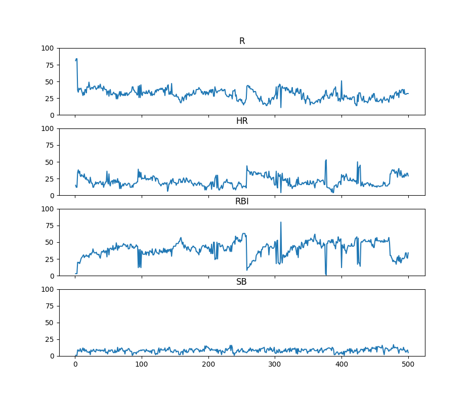

# fantasy-baseball-ai

Experimenting with a genetic algorithm to optimize player valuation for fantasy baseball drafts. 

Teams use their individual "opinions" to determine player values based on the player's statistics. Teams that perform well in the league advance to the next round and are also mutated. Randomly generated teams also join the league in order to introduce new strategies. 

Below is a sample output of the winning team's valuation weights over 500 generations for a simple league with 10 teams, 10 players per team. The only Roto categories are R, HR, RBI, and SB.  

   

To me this looks like there are central tendencies for each category, however(!), when too many teams adopt a similar strategy, the league becomes vulnerable to an upstart team with different valuation opinions. This different strategy does not work as well when other teams adopt it and the league trends back toward orthodox valuations. 

TODO:
* Introduce pitchers and pitching stats.
* Add positional constraints to team rosters.
* Allow teams to consider their current roster construction when choosing a new player. 
* ...
* In the long run an auction draft instead of a snake draft would be very cool!
